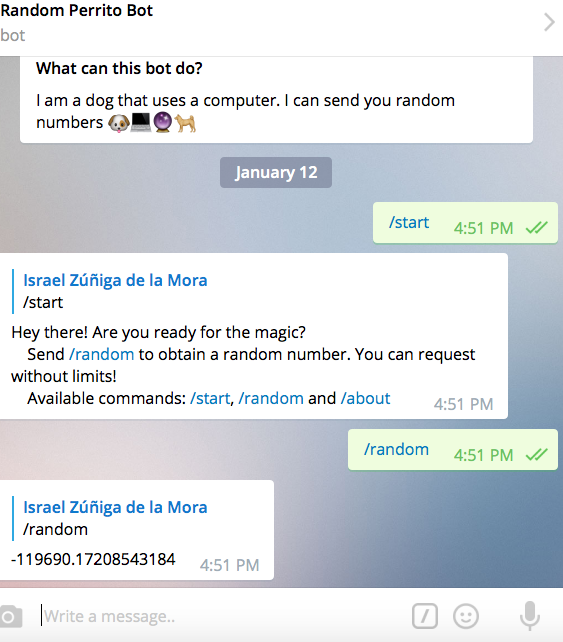
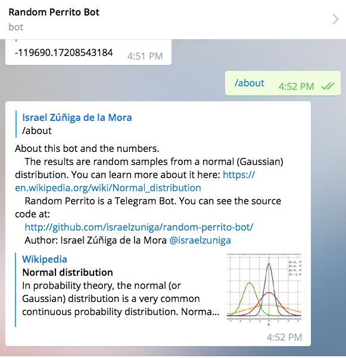

# Random Perrito Bot

Random numbers over Telegram.

Random Perrito is a Telegram Bot. It consists of a dog :dog: that sees trough a crystall ball :crystal_ball: and copies the results in the computer. :computer:

More exactly: The results are random samples from a [normal (Gaussian) distribution](https://en.wikipedia.org/wiki/Normal_distribution). It uses [Python's numpy.random.normal module](http://docs.scipy.org/doc/numpy/reference/generated/numpy.random.normal.html#numpy.random.normal) from the scipy/numpy modules.

## How to use it?
Just look for "@random_perrito_bot" in your Telegram app or use the (safe) following hyperlink: [@random_perrito_bot](https://telegram.me/random_perrito_bot)
Once you got Random Perrito in your Telegram app, send the /random command.

## Screenshots

### Project's forks or pull requests are welcome!
